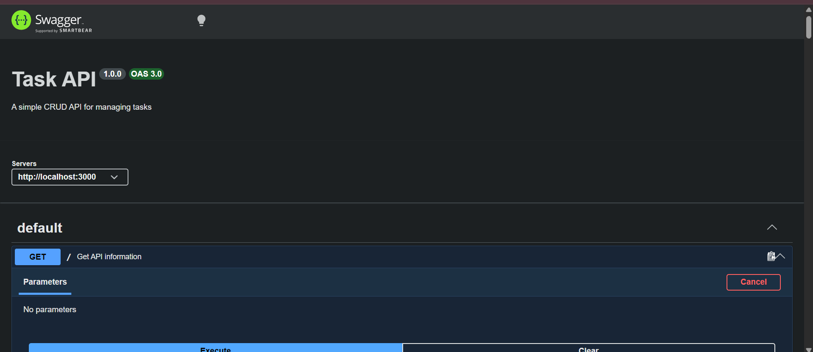

# Task API

A simple RESTful CRUD API built with Node.js and Express.js for managing tasks.

## Features

- Create a new task
- Retrieve all tasks
- Retrieve a task by ID
- Update a task
- Delete a task
- Input validation
- Health check endpoint
- Swagger/OpenAPI documentation
- In-memory task storage

## Technologies Used

- Node.js
- Express.js
- Swagger UI Express
- OpenAPI 3.0

## Project Structure

```text
task-crud-api/
├── .gitignore
├── openapi.json
├── package.json
├── package-lock.json
├── README.md
├── server.js
└── swagger-screenshot.png
```

## Installation

Clone the repository:

```bash
git clone https://github.com/dev-with-asmie/task-crud-api.git
```

Navigate into the project directory:

```bash
cd task-crud-api
```

Install the dependencies:

```bash
npm install
```

## Running the API

Start the server with:

```bash
node server.js
```

The API will run at:

```text
http://localhost:3000
```

## API Endpoints

| Method | Endpoint | Description |
|---|---|---|
| GET | `/` | Get API information |
| GET | `/health` | Check API health |
| GET | `/tasks` | Get all tasks |
| POST | `/tasks` | Create a new task |
| GET | `/tasks/:id` | Get a task by ID |
| PUT | `/tasks/:id` | Update a task |
| DELETE | `/tasks/:id` | Delete a task |

## Example Requests

### Get All Tasks

```http
GET /tasks
```

Example response:

```json
[
  {
    "id": 1,
    "title": "Learn Express",
    "done": false
  },
  {
    "id": 2,
    "title": "Build CRUD API",
    "done": false
  },
  {
    "id": 3,
    "title": "Test API",
    "done": true
  }
]
```

### Get a Task by ID

```http
GET /tasks/1
```

Example response:

```json
{
  "id": 1,
  "title": "Learn Express",
  "done": false
}
```

### Create a Task

```http
POST /tasks
```

Request body:

```json
{
  "title": "Buy milk"
}
```

Example response:

```json
{
  "id": 4,
  "title": "Buy milk",
  "done": false
}
```

The response uses HTTP status code `201 Created`.

### Update a Task

```http
PUT /tasks/1
```

Request body:

```json
{
  "title": "Learn Express properly",
  "done": true
}
```

Example response:

```json
{
  "id": 1,
  "title": "Learn Express properly",
  "done": true
}
```

The `title` and `done` fields can be updated independently or together.

### Delete a Task

```http
DELETE /tasks/1
```

A successful deletion returns:

```text
204 No Content
```

The response body is empty.

## Validation

The API validates incoming task data before processing it.

### Create Validation

The `title` field is required and must be a non-empty string.

For example:

```json
{}
```

returns:

```json
{
  "error": "Title is required and must be a non-empty string"
}
```

with HTTP status:

```text
400 Bad Request
```

### Update Validation

An update request must contain either `title` or `done`.

An empty request body returns:

```json
{
  "error": "Request body must contain title or done"
}
```

with HTTP status:

```text
400 Bad Request
```

The `title` must be a non-empty string and `done` must be a boolean.

### Unknown Task

If a task does not exist, the API returns:

```json
{
  "error": "Task 99 not found"
}
```

with HTTP status:

```text
404 Not Found
```

## HTTP Status Codes

| Status Code | Meaning |
|---|---|
| 200 | Request successful |
| 201 | Resource created successfully |
| 204 | Resource deleted successfully |
| 400 | Invalid request or validation error |
| 404 | Task not found |

## curl Output

The following is an actual `curl -i` request made against the running API:

```bash
curl -i http://localhost:3000/tasks/1
```

Output:

```text
HTTP/1.1 200 OK
X-Powered-By: Express
Content-Type: application/json; charset=utf-8
Content-Length: 45
ETag: W/"2d-ZN2ht4P5n4vXUj4HsI1QTp5HANY"
Date: Thu, 27 Aug 2026 07:57:57 GMT
Connection: keep-alive
Keep-Alive: timeout=5

{"id":1,"title":"Learn Express","done":false}
```

## Swagger API Documentation

Interactive Swagger UI documentation is available at:

```text
http://localhost:3000/docs
```

Swagger UI provides documentation for all API endpoints and allows the complete CRUD cycle to be tested using the **Try it out** feature.

### Swagger UI Screenshot



## Storage

This API uses an **in-memory array** to store tasks.

No database or external storage is used.

This means that task data is reset to the original sample tasks whenever the server is restarted.

## CRUD Operations

The API implements all four CRUD operations:

| CRUD Operation | HTTP Method | Endpoint |
|---|---|---|
| Create | POST | `/tasks` |
| Read | GET | `/tasks`, `/tasks/:id` |
| Update | PUT | `/tasks/:id` |
| Delete | DELETE | `/tasks/:id` |

## Author

Asmita Chakraborty